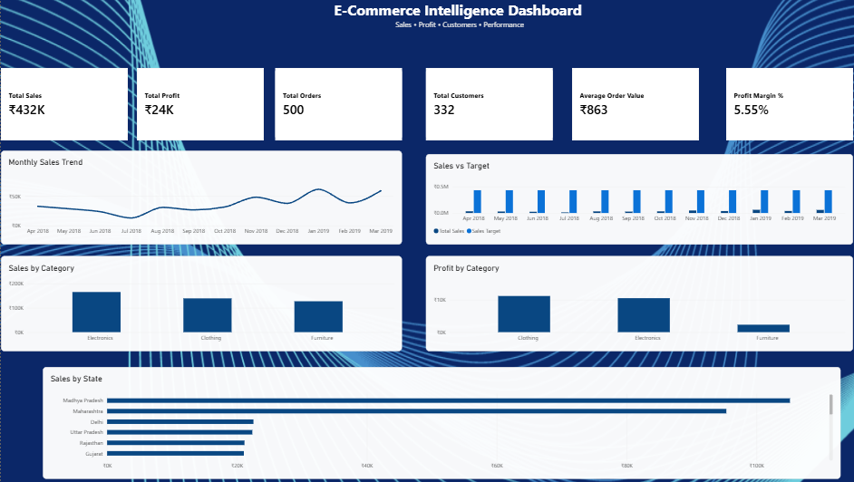
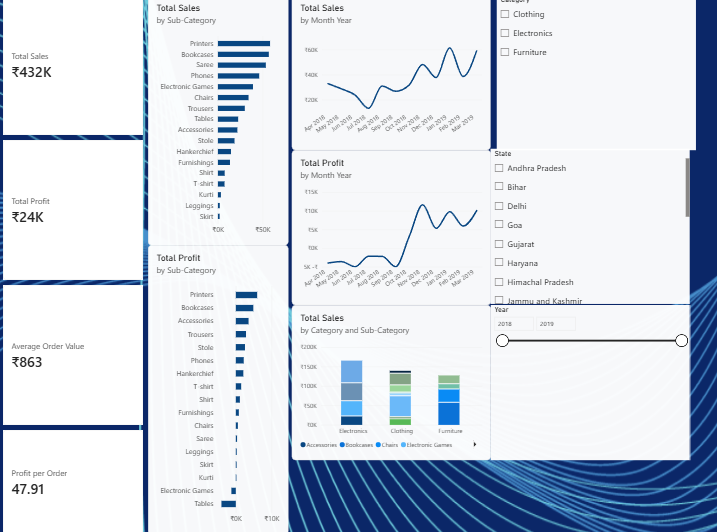
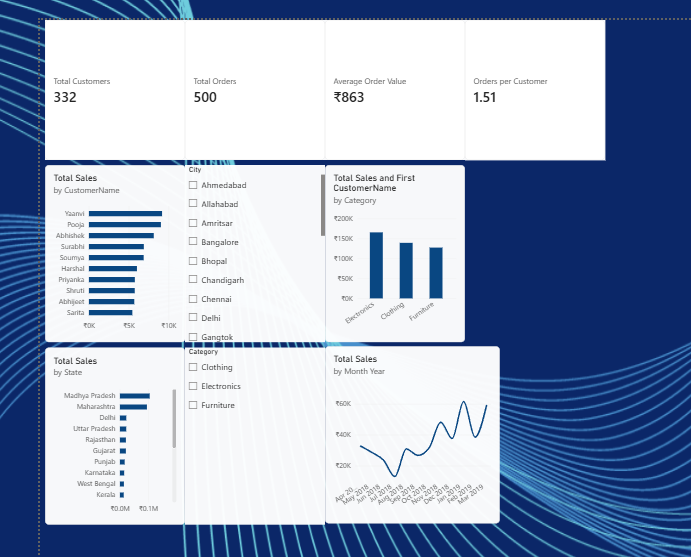
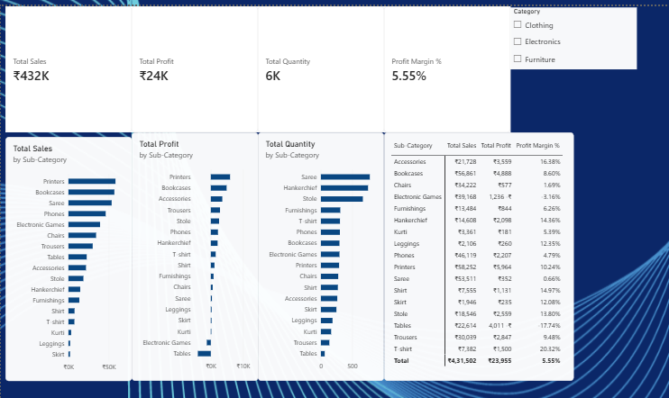
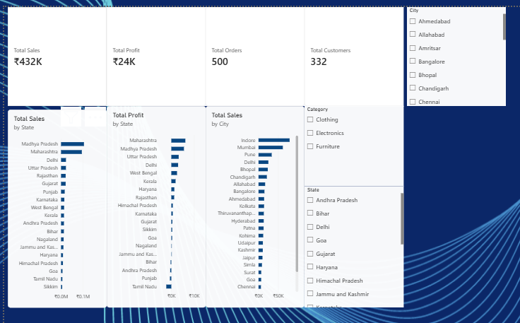
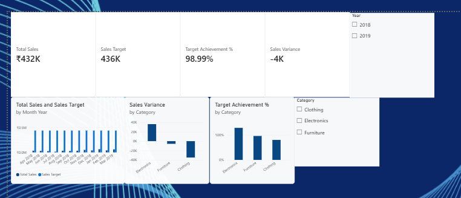

\# E-Commerce Intelligence Dashboard — Power BI


An end-to-end \*\*Business Intelligence and Data Analytics project\*\* built using Microsoft Power BI and an Indian e-commerce dataset.


The project transforms raw order data into an interactive dashboard covering sales performance, profitability, customers, products, geography, and target achievement.


\---


\## 📊 Project Overview


This Power BI project analyzes:


\- Sales performance

\- Profitability

\- Customer behavior

\- Product and sub-category performance

\- Geographic sales distribution

\- Monthly sales trends

\- Sales targets and achievement

\- Business KPIs


The goal is to demonstrate practical skills in \*\*data modeling, DAX, data visualization, business analysis, and dashboard design\*\*.


\---


\## 🛠️ Technologies Used


| Technology | Purpose |

|---|---|

| Microsoft Power BI | Dashboard and visualization |

| Power Query | Data cleaning and transformation |

| DAX | Measures and business calculations |

| CSV | Source datasets |

| Git \& GitHub | Version control and portfolio |


\---


\## 📁 Dataset


The project uses three datasets:


\### List of Orders

Contains order-level information:


\- Order ID

\- Order Date

\- Customer Name

\- State

\- City


\### Order Details

Contains transaction-level information:


\- Order ID

\- Amount

\- Profit

\- Quantity

\- Category

\- Sub-Category


\### Sales Target

Contains monthly sales targets by category.


\---


\## 🧮 Key DAX Measures


The dashboard includes measures such as:


\- Total Sales

\- Total Profit

\- Total Orders

\- Total Customers

\- Average Order Value

\- Profit Margin %

\- Sales Target

\- Target Achievement %

\- Sales Variance

\- Profit per Order

\- Average Quantity per Order

\- Orders per Customer


\---


\## 📈 Dashboard Pages

The Power BI dashboard is divided into six analytical views.

### 1. Executive Overview

High-level business performance including sales, profit, orders, customers, monthly trends, category performance, and geographic sales.



---

### 2. Sales & Profit Analysis

Detailed analysis of revenue and profitability across categories and sub-categories.



---

### 3. Customer Intelligence

Analysis of customer value, top customers, customer sales trends, states, and categories.



---

### 4. Product Intelligence

Analysis of product and sub-category sales, profit, quantity, and margins.



---

### 5. Geographic Analysis

Analysis of sales and profit across states and cities.



---

### 6. Target & Performance

Comparison of actual sales against targets, including target achievement and sales variance.




\## 🏗️ Data Model


The project uses a relational Power BI data model with:


\- `Orders`

\- `OrderDetails`

\- `SalesTargets`

\- `DimDate`

\- `DimCategory`

\- `DimMonth`


The model uses relationships between order, transaction, date, category, and target data to support interactive filtering and analysis.


\---


\## 🔄 Data Preparation


The raw data was prepared using Power Query.


Main transformations included:


\- Removing blank order records

\- Setting appropriate data types

\- Cleaning date fields

\- Preparing dimension tables

\- Creating relationships between datasets

\- Building a dedicated date dimension


\---


\## 🎯 Business Questions


The dashboard is designed to answer questions such as:


1\. How much revenue is being generated?

2\. How profitable is the business?

3\. Which categories and sub-categories generate the most sales?

4\. Which products contribute the most profit?

5\. Which states and cities generate the most revenue?

6\. Who are the highest-value customers?

7\. How are sales changing over time?

8\. Are sales meeting monthly targets?

9\. Which categories are above or below target?

10\. How efficiently is the business converting orders into revenue and profit?


\---


\## 📂 Project Structure


```text

E-Commerce-Intelligence-PowerBI/

│

├── Dataset/

│   ├── List of Orders.csv

│   ├── Order Details.csv

│   └── Sales target.csv

│

├── Documentation/

│

├── PowerBI/

│   └── E-Commerce-Intelligence-PowerBI.pbix

│

├── Python/

│

├── Screenshots/

│

├── SQL/

│

├── .gitignore

└── README.md

🚀 Skills Demonstrated
- Power BI
- Power Query
- DAX
- Data Cleaning
- Data Modeling
- Data Visualization
- Business Intelligence
- KPI Development
- Exploratory Data Analysis
- Customer Analytics
- Sales Analytics
- Profitability Analysis
- Geographic Analysis

👨‍💻 Author
Vaibhav Haldankar
Computer Science / MCA Graduate
Interested in AI/ML Engineering, Data Analytics, and Business Intelligence.
GitHub: NIGHTFURY-999
📌 Project Status
🚧 Actively developing
The dashboard and documentation will continue to be improved with additional analysis, screenshots, and insights.

